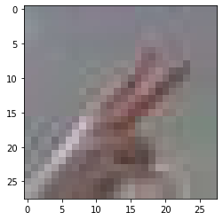

```python
!pip install pillow   

from PIL import Image
import os, glob

print("PIL 라이브러리 import 완료!")
```

    Requirement already satisfied: pillow in ./anaconda3/envs/aiffel/lib/python3.7/site-packages (7.2.0)
    PIL 라이브러리 import 완료!


```python
import os
# 가위 이미지가 저장된 디렉토리 아래의 모든 jpg 파일을 읽어들여서
image_dir_path = os.getenv("HOME") + "/aiffel/rock_scissor_paper/scissor"
print("이미지 디렉토리 경로: ", image_dir_path)

images=glob.glob(image_dir_path + "/*.jpg")  

# 파일마다 모두 28x28 사이즈로 바꾸어 저장합니다.
target_size=(28,28)
for img in images:
    old_img=Image.open(img)
    new_img=old_img.resize(target_size,Image.ANTIALIAS)
    new_img.save(img,"JPEG")

print("가위 이미지 resize 완료!")
```

    이미지 디렉토리 경로:  /home/aiffel0042/aiffel/rock_scissor_paper/scissor
    가위 이미지 resize 완료!


```python
import os

image_dir_path = os.getenv("HOME") + "/aiffel/rock_scissor_paper/rock"
print("이미지 디렉토리 경로: ", image_dir_path)

images=glob.glob(image_dir_path + "/*.jpg")  

target_size=(28,28)
for img in images:
    old_img=Image.open(img)
    new_img=old_img.resize(target_size,Image.ANTIALIAS)
    new_img.save(img,"JPEG")

print("바위 이미지 resize 완료!")
```

    이미지 디렉토리 경로:  /home/aiffel0042/aiffel/rock_scissor_paper/rock
    바위 이미지 resize 완료!


```python
import os

image_dir_path = os.getenv("HOME") + "/aiffel/rock_scissor_paper/paper"
print("이미지 디렉토리 경로: ", image_dir_path)

images=glob.glob(image_dir_path + "/*.jpg") 

target_size=(28,28)
for img in images:
    old_img=Image.open(img)
    new_img=old_img.resize(target_size,Image.ANTIALIAS)
    new_img.save(img,"JPEG")

print("보 이미지 resize 완료!")
```

    이미지 디렉토리 경로:  /home/aiffel0042/aiffel/rock_scissor_paper/paper
    보 이미지 resize 완료!


```python
import numpy as np

def load_data(img_path):
    # 가위 : 0, 바위 : 1, 보 : 2
    number_of_data=2165   # 가위바위보 이미지 개수 총합에 주의하세요.
    img_size=28
    color=3
    #이미지 데이터와 라벨(가위 : 0, 바위 : 1, 보 : 2) 데이터를 담을 행렬(matrix) 영역을 생성합니다.
    imgs=np.zeros(number_of_data*img_size*img_size*color,dtype=np.int32).reshape(number_of_data,img_size,img_size,color)
    labels=np.zeros(number_of_data,dtype=np.int32)

    idx=0
    for file in glob.iglob(img_path+'/scissor/*.jpg'):
        img = np.array(Image.open(file),dtype=np.int32)
        imgs[idx,:,:,:]=img    # 데이터 영역에 이미지 행렬을 복사
        labels[idx]=0   # 가위 : 0
        idx=idx+1

    for file in glob.iglob(img_path+'/rock/*.jpg'):
        img = np.array(Image.open(file),dtype=np.int32)
        imgs[idx,:,:,:]=img    # 데이터 영역에 이미지 행렬을 복사
        labels[idx]=1   # 바위 : 1
        idx=idx+1       
    
    for file in glob.iglob(img_path+'/paper/*.jpg'):
        img = np.array(Image.open(file),dtype=np.int32)
        imgs[idx,:,:,:]=img    # 데이터 영역에 이미지 행렬을 복사
        labels[idx]=2   # 보 : 2
        idx=idx+1
        
    print("학습데이터(x_train)의 이미지 개수는",idx,"입니다.")
    return imgs, labels

image_dir_path = os.getenv("HOME") + "/aiffel/rock_scissor_paper"
(x_train, y_train)=load_data(image_dir_path)
x_train_norm = x_train/255.0   # 입력은 0~1 사이의 값으로 정규화

print("x_train shape: {}".format(x_train.shape))
print("y_train shape: {}".format(y_train.shape))
```

    학습데이터(x_train)의 이미지 개수는 2165 입니다.
    x_train shape: (2165, 28, 28, 3)
    y_train shape: (2165,)


```python
import matplotlib.pyplot as plt
plt.imshow(x_train[1])
print('라벨: ', y_train[0])
```

    라벨:  0





```python
import tensorflow as tf
from tensorflow import keras
import numpy as np

# model을 직접 만들어 보세요.
# Hint! model의 입력/출력부에 특히 유의해 주세요. 가위바위보 데이터셋은 MNIST 데이터셋과 어떤 점이 달라졌나요?
# [[YOUR CODE]]
model=keras.models.Sequential()
model.add(keras.layers.Conv2D(16, (3,3), activation='relu', input_shape=(28,28,3)))
model.add(keras.layers.MaxPool2D(2,2))
model.add(keras.layers.Conv2D(32, (3,3), activation='relu'))
model.add(keras.layers.MaxPooling2D((2,2)))
model.add(keras.layers.Flatten())
model.add(keras.layers.Dense(32, activation='relu'))
model.add(keras.layers.Dense(10, activation='softmax'))


model.summary()
```

    Model: "sequential"
    _________________________________________________________________
    Layer (type)                 Output Shape              Param #   
    =================================================================
    conv2d (Conv2D)              (None, 26, 26, 16)        448       
    _________________________________________________________________
    max_pooling2d (MaxPooling2D) (None, 13, 13, 16)        0         
    _________________________________________________________________
    conv2d_1 (Conv2D)            (None, 11, 11, 32)        4640      
    _________________________________________________________________
    max_pooling2d_1 (MaxPooling2 (None, 5, 5, 32)          0         
    _________________________________________________________________
    flatten (Flatten)            (None, 800)               0         
    _________________________________________________________________
    dense (Dense)                (None, 32)                25632     
    _________________________________________________________________
    dense_1 (Dense)              (None, 10)                330       
    =================================================================
    Total params: 31,050
    Trainable params: 31,050
    Non-trainable params: 0
    _________________________________________________________________


```python
model.compile(optimizer='adam',
             loss='sparse_categorical_crossentropy',
             metrics=['accuracy'])

model.fit(x_train, y_train, epochs=20)
```

    Epoch 1/20
    68/68 [==============================] - 4s 59ms/step - loss: 6.4505 - accuracy: 0.3815
    Epoch 2/20
    68/68 [==============================] - 0s 1ms/step - loss: 1.0165 - accuracy: 0.5515
    Epoch 3/20
    68/68 [==============================] - 0s 1ms/step - loss: 0.8902 - accuracy: 0.6106
    Epoch 4/20
    68/68 [==============================] - 0s 1ms/step - loss: 0.7866 - accuracy: 0.6753
    Epoch 5/20
    68/68 [==============================] - 0s 1ms/step - loss: 0.6194 - accuracy: 0.7473
    Epoch 6/20
    68/68 [==============================] - 0s 1ms/step - loss: 0.5194 - accuracy: 0.7921
    Epoch 7/20
    68/68 [==============================] - 0s 1ms/step - loss: 0.4147 - accuracy: 0.8430
    Epoch 8/20
    68/68 [==============================] - 0s 1ms/step - loss: 0.3820 - accuracy: 0.8522
    Epoch 9/20
    68/68 [==============================] - 0s 1ms/step - loss: 0.3105 - accuracy: 0.8845
    Epoch 10/20
    68/68 [==============================] - 0s 1ms/step - loss: 0.2578 - accuracy: 0.9155
    Epoch 11/20
    68/68 [==============================] - 0s 1ms/step - loss: 0.2368 - accuracy: 0.9090
    Epoch 12/20
    68/68 [==============================] - 0s 1ms/step - loss: 0.1971 - accuracy: 0.9321
    Epoch 13/20
    68/68 [==============================] - 0s 1ms/step - loss: 0.1997 - accuracy: 0.9293
    Epoch 14/20
    68/68 [==============================] - 0s 1ms/step - loss: 0.1544 - accuracy: 0.9446
    Epoch 15/20
    68/68 [==============================] - 0s 1ms/step - loss: 0.1175 - accuracy: 0.9654
    Epoch 16/20
    68/68 [==============================] - 0s 1ms/step - loss: 0.0916 - accuracy: 0.9723
    Epoch 17/20
    68/68 [==============================] - 0s 1ms/step - loss: 0.0766 - accuracy: 0.9755
    Epoch 18/20
    68/68 [==============================] - 0s 1ms/step - loss: 0.0678 - accuracy: 0.9834
    Epoch 19/20
    68/68 [==============================] - 0s 1ms/step - loss: 0.0636 - accuracy: 0.9843
    Epoch 20/20
    68/68 [==============================] - 0s 1ms/step - loss: 0.0690 - accuracy: 0.9815


    <tensorflow.python.keras.callbacks.History at 0x7f054c0b2cd0>


```python
def load_data(img_path):
    # 가위 : 0, 바위 : 1, 보 : 2
    number_of_data=300   # 가위바위보 이미지 개수 총합에 주의하세요.
    img_size=28
    color=3
    #이미지 데이터와 라벨(가위 : 0, 바위 : 1, 보 : 2) 데이터를 담을 행렬(matrix) 영역을 생성합니다.
    imgs=np.zeros(number_of_data*img_size*img_size*color,dtype=np.int32).reshape(number_of_data,img_size,img_size,color)
    labels=np.zeros(number_of_data,dtype=np.int32)

    idx=0
    for file in glob.iglob(img_path+'/scissor/*.jpg'):
        img = np.array(Image.open(file),dtype=np.int32)
        imgs[idx,:,:,:]=img    # 데이터 영역에 이미지 행렬을 복사
        labels[idx]=0   # 가위 : 0
        idx=idx+1

    for file in glob.iglob(img_path+'/rock/*.jpg'):
        img = np.array(Image.open(file),dtype=np.int32)
        imgs[idx,:,:,:]=img    # 데이터 영역에 이미지 행렬을 복사
        labels[idx]=1   # 바위 : 1
        idx=idx+1       
    
    for file in glob.iglob(img_path+'/paper/*.jpg'):
        img = np.array(Image.open(file),dtype=np.int32)
        imgs[idx,:,:,:]=img    # 데이터 영역에 이미지 행렬을 복사
        labels[idx]=2   # 보 : 2
        idx=idx+1
        
    print("학습데이터(x_test)의 이미지 개수는",idx,"입니다.")
    return imgs, labels

image_dir_path = os.getenv("HOME") + "/Downloads/rock_scissor_paper"
(x_test, y_test)=load_data(image_dir_path)
x_test_norm = x_test/255.0   # 입력은 0~1 사이의 값으로 정규화

print("x_test shape: {}".format(x_test.shape))
print("y_test shape: {}".format(y_test.shape))
```

    학습데이터(x_test)의 이미지 개수는 300 입니다.
    x_test shape: (300, 28, 28, 3)
    y_test shape: (300,)


```python
test_loss, test_accuracy = model.evaluate(x_test,y_test, verbose=2)
print("test_loss: {} ".format(test_loss))
print("test_accuracy: {}".format(test_accuracy))
```

    10/10 - 2s - loss: 1.6623 - accuracy: 0.6300
    test_loss: 1.6622995138168335 
    test_accuracy: 0.6299999952316284


훈련 반복 횟수에 관한 하이퍼 파라미터에 따라 모델의 정확도가 달라지지만 같은 횟수여도 결과값이 다를 수 있다는 것을 확인했다. 때문에 최적화된 하이퍼 파라미터의 값을 구하는 다른 방법이 필요하다는 것을 느꼈다.
또한 처음에는 트레이닝 데이터셋의 수를 300으로 한정한 상황에서 더 나은 예측 모델을 위해 더 질 좋은 데이터를 선별하고자 헀으나 같은 사람의 손을 기준으로 한 테스트 셋에서도 정확도가 60%남짓이었으나 트레이닝 데이터셋의 수를 2165개로 늘리자 정확도가 늘었으며 데이터를 정확히 선별하는 것 보다는 데이터셋의 수를 늘리는 편이 훨씬 낫다는 것을 알 수 있었다.
다만 기존 모델을 개선하는 해결방법에 대해선 시도하지 못했다.
