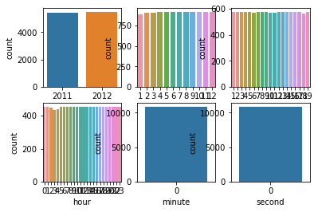
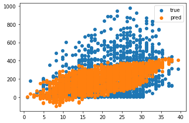
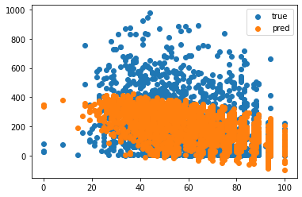
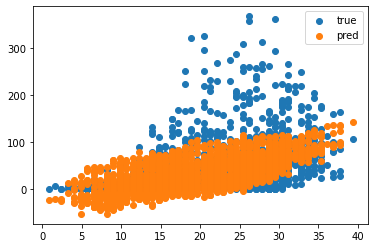
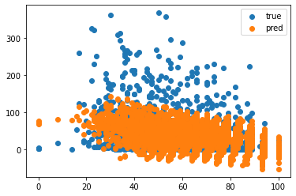

(1) 데이터 가져오기
여기에서 데이터를 다운받습니다.
다운받은 파일의 압축을 해제하고 bike-sharing-demand/train.csv 데이터를 train 변수로 가져옵니다.
(2) datetime 컬럼을 datetime 자료형으로 변환하고 연, 월, 일, 시, 분, 초까지 6가지 컬럼 생성하기
to_datetime 활용 : 링크 참조
pandas datetime extract year month day 키워드로 검색해 보기
(3) year, month, day, hour, minute, second 데이터 개수 시각화하기
sns.countplot 활용해서 시각화하기
subplot을 활용해서 한 번에 6개의 그래프 함께 시각화하기
(4) X, y 컬럼 선택 및 train/test 데이터 분리
X에는 문자열 데이터, 쓸모없는 데이터를 제외한 컬럼의 데이터 넣기
count 값을 맞추고자 하므로, y 변수에 count 컬럼의 데이터 넣기
(5) LinearRegression 모델 학습
sklearn의 LinearRegression 모델 불러오기 및 학습하기
(6) 학습된 모델로 X_test에 대한 예측값 출력 및 손실함수값 계산
학습된 모델에 X_test를 입력해서 예측값 출력하기
모델이 예측한 값과 정답 target 간의 손실함수 값 계산하기
mse 값과 함께 rmse 값도 계산하기
(7) x축은 temp 또는 humidity로, y축은 count로 예측 결과 시각화하기
x축에 X 데이터 중 temp 데이터를, y축에는 count 데이터를 넣어서 시각화하기
x축에 X 데이터 중 humidity 데이터를, y축에는 count 데이터를 넣어서 시각화하기


```python
#데이터 가져오기

import pandas as pd
row_data = pd.read_csv('~/Downloads/bike-sharing-demand/train.csv')
```


```python
#datetime 컬럼을 datetime자료형 6개 컬럼으로 나누기

row_data['datetime'] = pd.to_datetime(row_data['datetime'])

row_data['year'] = pd.DatetimeIndex(row_data['datetime']).year
row_data['month'] = pd.DatetimeIndex(row_data['datetime']).month
row_data['day'] = pd.DatetimeIndex(row_data['datetime']).day
row_data['hour'] = pd.DatetimeIndex(row_data['datetime']).hour
row_data['minute'] = pd.DatetimeIndex(row_data['datetime']).minute
row_data['second'] = pd.DatetimeIndex(row_data['datetime']).second

# print(date['year']) #검색해보기
# print(date['month'])
# print(date['day'])
```


```python
#데이터 개수 시각화

from matplotlib import pyplot as plt
import seaborn as sns

ax1 = plt.subplot(2, 3, 1)
sns.countplot(x='year', data=row_data)

ax2 = plt.subplot(2, 3, 2)
sns.countplot(x='month', data=row_data)

ax3 = plt.subplot(2, 3, 3)
sns.countplot(x='day', data=row_data)

ax4 = plt.subplot(2, 3, 4)
sns.countplot(x='hour', data=row_data)

ax5 = plt.subplot(2, 3, 5)
sns.countplot(x='minute', data=row_data)

ax6 = plt.subplot(2, 3, 6)
sns.countplot(x='second', data=row_data)

plt.show()

```





```python
#X, y 컬럼 선택 및 train/test 데이터 분리

X = row_data[['month', 'hour', 'minute', 'season', 'holiday', 'workingday', 'weather', 'temp',
          'atemp', 'humidity', 'windspeed']].values
y = row_data['count'].values

from sklearn.model_selection import train_test_split

X_train, X_test, y_train, y_test = train_test_split(X, y, test_size=0.2, random_state=42)

print(X_train.shape, y_train.shape)
print(X_test.shape, y_test.shape)

```

    (8708, 11) (8708,)
    (2178, 11) (2178,)


```python
#모델 학습

from sklearn.linear_model import LinearRegression

model = LinearRegression()

model.fit(X_train, y_train)
```


    LinearRegression()


```python
#loss값을 mse, rmse 방식으로 측정

predictions = model.predict(X_test)
predictions


from sklearn.metrics import mean_squared_error

mse = mean_squared_error(y_test, predictions)
print(mse)

rmse = mean_squared_error(y_test, predictions, squared = False)
print(rmse)
```

    21660.42472402031
    147.17481008657802


```python
# temp에 따른 count 예측 결과 시각화

plt.scatter(X_test[:,7], y_test, label="true")
plt.scatter(X_test[:,7], predictions, label="pred")
plt.legend()
plt.show()
```





```python
#humidity에 따른 count 예측 결과 시각화

plt.scatter(X_test[:,9], y_test, label="true")
plt.scatter(X_test[:,9], predictions, label="pred")
plt.legend()
plt.show()
```





'year', 'minute', 'second'의 경우 모든 항목이 동일값을 가지거나 큰 의미가 없었으며 'casual'을 예측하는 경우 mse값과 rmse값이 각각 1418과 37로, 'registered'를 예측하는 경우 각각 16193과 127이 나와 'casual'의 경우 날씨, 시간 등 변수에 의해 훨씬 많은 영향을, 반대로 'registered'의 경우 변화에 영향을 덜 받는 다는 것을 확인하였다.


