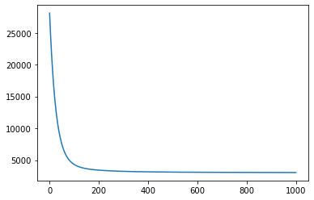
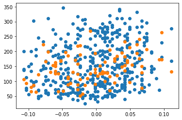

(1) 데이터 가져오기
sklearn.datasets의 load_diabetes에서 데이터를 가져와주세요.
diabetes의 data를 df_X에, target을 df_y에 저장해주세요.
(2) 모델에 입력할 데이터 X 준비하기
df_X에 있는 값들을 numpy array로 변환해서 저장해주세요.
(3) 모델에 예측할 데이터 y 준비하기
df_y에 있는 값들을 numpy array로 변환해서 저장해주세요.
(4) train 데이터와 test 데이터로 분리하기
X와 y 데이터를 각각 train 데이터와 test 데이터로 분리해주세요.
(5) 모델 준비하기
입력 데이터 개수에 맞는 가중치 W와 b를 준비해주세요.
모델 함수를 구현해주세요.
(6) 손실함수 loss 정의하기
손실함수를 MSE 함수로 정의해주세요.
(7) 기울기를 구하는 gradient 함수 구현하기
기울기를 계산하는 gradient 함수를 구현해주세요.
(8) 하이퍼 파라미터인 학습률 설정하기
학습률, learning rate 를 설정해주세요
만약 학습이 잘 되지 않는다면 learning rate 값을 한번 여러 가지로 설정하며 실험해 보세요.
(9) 모델 학습하기
정의된 손실함수와 기울기 함수로 모델을 학습해주세요.
loss값이 충분히 떨어질 때까지 학습을 진행해주세요.
입력하는 데이터인 X에 들어가는 특성 컬럼들을 몇 개 빼도 괜찮습니다. 다양한 데이터로 실험해 보세요.
(10) test 데이터에 대한 성능 확인하기
test 데이터에 대한 성능을 확인해주세요.
(11) 정답 데이터와 예측한 데이터 시각화하기
x축에는 X 데이터의 첫 번째 컬럼을, y축에는 정답인 target 데이터를 넣어서 모델이 예측한 데이터를 시각화해 주세요.


```python
#데이터 가져오기

from sklearn.datasets import load_diabetes
import pandas as pd

diabetes = load_diabetes()


df_X = pd.DataFrame(diabetes.data, columns=diabetes.feature_names)  #df_X로 지정

#age, sex, bmi, bp, s1, s2, s3, s4, s5, s6 ,2867기준
#df_X.drop('age', axis=1, inplace=True) #2828 but 가시성을 위해 끼워 넣음
#df_X.drop('sex', axis=1, inplace=True) #2973 높아짐
#df_X.drop('bmi', axis=1, inplace=True) #3194 높아짐
#df_X.drop('bp', axis=1, inplace=True) #2879
df_X.drop('s1', axis=1, inplace=True) #2838
df_X.drop('s2', axis=1, inplace=True) #2858
df_X.drop('s3', axis=1, inplace=True) #2858
df_X.drop('s4', axis=1, inplace=True) #2843
#df_X.drop('s5', axis=1, inplace=True) #3271 높아짐
#df_X.drop('s6', axis=1, inplace=True) #2886


df_y = diabetes.target  #df_y로 지정
```


```python
#데이터를 numpy array로 저장.

import numpy as np

X = np.array(df_X)
y = np.array(df_y)
```


```python
#train 데이터와 test 데이터 분리

from sklearn.model_selection import train_test_split

X_train, X_test, y_train, y_test = train_test_split(X, y, test_size=0.2, random_state=42)

print(X_train.shape, y_train.shape)
print(X_test.shape, y_test.shape)
```

    (353, 6) (353,)
    (89, 6) (89,)


```python
#모델함수 구현

W = np.random.rand(6) #랜덤값을 가진 변수 생성
b = np.random.rand()

def model(X, W, b):   #모델 함수 생성
    predictions = 0
    for i in range(0, 6):
        predictions += X[:, i] * W[i]
    predictions += b
    return predictions
```


```python
def MSE(a, b):
    mse = ((a - b) ** 2).mean()  # 두 값의 차이의 제곱의 평균
    return mse

def loss(X, W, b, y): # MSE를 사용하는 loss 함수 지정
    predictions = model(X, W, b)
    L = MSE(predictions, y)
    return L
```


```python
def gradient(X, W, b, y): #gradient 함수 구현
    N = len(W) #기본 10
    y_pred = model(X, W, b)
    dW = 1/N * 2 * X.T.dot(y_pred - y)
    db = 2 * (y_pred - y).mean()
    return dW, db

```


```python
LEARNING_RATE = 0.01 #learning rate 지정

losses = []

for i in range(1, 1001):  #정의된 손실함수와 기울기 함수로 모델을 학습
    dW, db = gradient(X_train, W, b, y_train)
    W -= LEARNING_RATE * dW
    b -= LEARNING_RATE * db
    L = loss(X, W, b, y)
    losses.append(L)
    if i % 100 == 0:
        print('Iteration %d : Loss %0.4f' % (i, L))
```

    Iteration 100 : Loss 4331.2014
    Iteration 200 : Loss 3426.3436
    Iteration 300 : Loss 3236.4990
    Iteration 400 : Loss 3156.6328
    Iteration 500 : Loss 3114.8806
    Iteration 600 : Loss 3090.1363
    Iteration 700 : Loss 3074.4434
    Iteration 800 : Loss 3064.1337
    Iteration 900 : Loss 3057.2231
    Iteration 1000 : Loss 3052.5289


```python
from matplotlib import pyplot as plt

plt.plot(losses)
plt.show()
```





```python
prediction = model(X_test, W, b)  #test 데이터에 대한 성능 평가
mse = loss(X_test, W, b, y_test)
mse
```


    2821.609293663363


```python
plt.scatter(X[:,0], y) #예측 데이터 시각화
plt.scatter(X_test[:, 0], prediction)
plt.show()
```





mse 결과에 있어서 가장 의미 있는 지표는 'sex', 'bmi', 's5'이다. 다만 'age'데이터를 제외할 경우 예측 정확도에 큰 차이는 없었지만 시각화 과정에서 가시성을 위해 집어넣었고 'bp'와 's6'의 경우 's1', 's2', 's3', 's4'을 뺐을때와 큰 차이가 없다는 것을 확인하기위해 집어넣었다. 이 경우 W의 초기 랜덤값 생성시 개수를 주의하여야한다.
mse와 gradient함수를 직접 지정하여 호출하였다. 이 부분은 하이퍼 파라미터에 속하면서도 기존의 모델에 포함되어있기에 변수로서 사용하기 어려운 부분이었다. 그러나 결과 값은 기존의 학습모델을 사용하는 것이 조금 더 좋았다.

