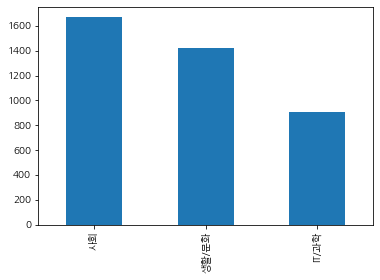

```python
# 크롤러를 만들기 전 필요한 도구들을 임포트합니다.
import requests
import pandas as pd
from bs4 import BeautifulSoup

# 페이지 수, 카테고리, 날짜를 입력값으로 받습니다.
def make_urllist(page_num, code, date): 
  urllist= []
  for i in range(1, page_num + 1):
    url = 'https://news.naver.com/main/list.nhn?mode=LSD&mid=sec&sid1='+str(code)+'&date='+str(date)+'&page='+str(i)   
    news = requests.get(url)

    # BeautifulSoup의 인스턴스 생성합니다. 파서는 html.parser를 사용합니다.
    soup = BeautifulSoup(news.content, 'html.parser')

    # CASE 1
    news_list = soup.select('.newsflash_body .type06_headline li dl')
    # CASE 2
    news_list.extend(soup.select('.newsflash_body .type06 li dl'))
        
    # 각 뉴스로부터 a 태그인 <a href ='주소'> 에서 '주소'만을 가져옵니다.
    for line in news_list:
        urllist.append(line.a.get('href'))
  return urllist
```


```python
idx2word = {'101' : '경제', '102' : '사회', '103' : '생활/문화', '105' : 'IT/과학'}
from newspaper import Article

#- 데이터프레임을 생성하는 함수입니다.
def make_data(urllist, code):
  text_list = []
  for url in urllist:
    article = Article(url, language='ko')
    article.download()
    article.parse()
    text_list.append(article.text)

  #- 데이터프레임의 'news' 키 아래 파싱한 텍스트를 밸류로 붙여줍니다.
  df = pd.DataFrame({'news': text_list})

  #- 데이터프레임의 'code' 키 아래 한글 카테고리명을 붙여줍니다.
  df['code'] = idx2word[str(code)]
  return df
```


```python
code_list = [102, 103, 105]

def make_total_data(page_num, code_list, date):
  df = None

  for code in code_list:
    url_list = make_urllist(page_num, code, date)
    df_temp = make_data(url_list, code)
    print(str(code)+'번 코드에 대한 데이터를 만들었습니다.')

    if df is not None:
      df = pd.concat([df, df_temp])
    else:
      df = df_temp

  return df

df = make_total_data(1, code_list, 20200506) # 2020 05 06의 1페이지, code 102, 103, 105 를 갖고있는 데이터만 출력
```

    102번 코드에 대한 데이터를 만들었습니다.
    103번 코드에 대한 데이터를 만들었습니다.
    105번 코드에 대한 데이터를 만들었습니다.


```python
import os

csv_path = os.getenv("HOME") + "/aiffel/news_crawler/news_data.csv" #저장한 데이터를 경로상에서 읽어오기. code_list = [101, 102, 103, 105]
df = pd.read_table(csv_path, sep=',')
df.head()

# 정규 표현식을 이용해서 한글 외의 문자는 전부 제거합니다.
df['news'] = df['news'].str.replace("[^ㄱ-ㅎㅏ-ㅣ가-힣 ]","")
df['news']
```


    0       파주시청 사진제공파주시 파주시청 사진제공파주시파주파이낸셜뉴스 강근주 기자 파주시는 ...
    1       동영상 뉴스이천 물류창고 화재 발화지점으로 지목된 지하 층에서 산소절단기의 산소 공...
    2       황범순 의정부시 부시장 을지대학교 의정부캠퍼스 및 부속병원 공사현장 안전점검 사진제...
    3       귀갓길 여성을 쫓아가 성범죄를 시도한 대 남성이 구속됐습니다서울 강남경찰서는 강간상...
    4       서울연합뉴스 대한약사회가 일부터 코로나바이러스 감염증 대응 체계를 사회적 거리두기에...
                                  ...                        
    5119    신종 코로나바이러스 감염증코로나 사태 이후 가정의 달 월에도 언택트비대면 신풍속도가...
    5120    는 소비자로부터 월 이용료 만만원을 받고 초고속 인터넷을 제공한다 그런 브로드밴드가...
    5121    머리를 긁고 있는 오랑우탄 몸을 긁는 행동을 따라 하는 것은 부정적 감정과 관련이 ...
    5122    가 오는 일 정식 출시하는 스마트폰 벨벳이 사실상 공짜폰이 될 전망이다 단말기 가격...
    5123    이미지제공게티이미지뱅크 이미지제공게티이미지뱅크  전자신문  전자신문인터넷 무단전재 ...
    Name: news, Length: 5124, dtype: object


```python
df.drop_duplicates(subset=['news'], inplace=True)

print('뉴스 기사의 개수: ',len(df))
```

    뉴스 기사의 개수:  3994


```python
import matplotlib.pyplot as plt
plt.rc('font', family='NanumGothic')
```


```python
df['code'].value_counts().plot(kind = 'bar')
```


    <matplotlib.axes._subplots.AxesSubplot at 0x7f02d43b6550>





```python
print(df.groupby('code').size().reset_index(name = 'count'))
```

        code  count
    0  IT/과학    903
    1     사회   1668
    2  생활/문화   1423


```python
from konlpy.tag import Mecab
mecab = Mecab()

kor_text = '밤에 귀가하던 여성에게 범죄를 시도한 대 남성이 구속됐다서울 제주경찰서는 \
            상해 혐의로 씨를 구속해 수사하고 있다고 일 밝혔다씨는 지난달 일 피해 여성을 \
            인근 지하철 역에서부터 따라가 폭행을 시도하려다가 도망간 혐의를 받는다피해 \
            여성이 저항하자 놀란 씨는 도망갔으며 신고를 받고 주변을 수색하던 경찰에 \
            체포됐다피해 여성은 이 과정에서 경미한 부상을 입은 것으로 전해졌다'

#- 형태소 분석, 즉 토큰화(tokenization)를 합니다.
print(mecab.morphs(kor_text))
```

    ['밤', '에', '귀가', '하', '던', '여성', '에게', '범죄', '를', '시도', '한', '대', '남성', '이', '구속', '됐', '다', '서울', '제주', '경찰서', '는', '상해', '혐의', '로', '씨', '를', '구속', '해', '수사', '하', '고', '있', '다고', '일', '밝혔', '다', '씨', '는', '지난달', '일', '피해', '여성', '을', '인근', '지하철', '역', '에서부터', '따라가', '폭행', '을', '시도', '하', '려다가', '도망간', '혐의', '를', '받', '는다', '피해', '여성', '이', '저항', '하', '자', '놀란', '씨', '는', '도망갔으며', '신고', '를', '받', '고', '주변', '을', '수색', '하', '던', '경찰', '에', '체포', '됐', '다', '피해', '여성', '은', '이', '과정', '에서', '경미', '한', '부상', '을', '입', '은', '것', '으로', '전해졌', '다']


```python
from konlpy.tag import Hannanum
hannanum = Hannanum()

kor_text = '밤에 귀가하던 여성에게 범죄를 시도한 대 남성이 구속됐다서울 제주경찰서는 \
            상해 혐의로 씨를 구속해 수사하고 있다고 일 밝혔다씨는 지난달 일 피해 여성을 \
            인근 지하철 역에서부터 따라가 폭행을 시도하려다가 도망간 혐의를 받는다피해 \
            여성이 저항하자 놀란 씨는 도망갔으며 신고를 받고 주변을 수색하던 경찰에 \
            체포됐다피해 여성은 이 과정에서 경미한 부상을 입은 것으로 전해졌다'

#- 형태소 분석, 즉 토큰화(tokenization)를 합니다.
print(hannanum.morphs(kor_text))
```

    ['밤', '에', '귀가', '하', '던', '여성', '에게', '범죄', '를', '시도', '하', 'ㄴ', '대', '남성', '이', '구속됐다서울', '제주경찰', '서는', '상하', '어', '혐의', '로', '씨', '를', '구속해', '수사', '하고', '있', '다', '고', '일', '밝혔다씨', '는', '지난달', '일', '피하', '어', '여성', '을', '인근', '지하철', '역', '에서부터', '따르', '아', '가', '아', '폭행', '을', '시도', '하', '려', '다가', '도망가', 'ㄴ', '혐의', '를', '받는다피해', '여성', '이', '저항', '하', '자', '놀라', 'ㄴ', '씨', '는', '도망가', '아며', '신고', '를', '받', '고', '주변', '을', '수색', '하', '던', '경찰', '에', '체포됐다피해', '여성', '은', '이', '과정', '에서', '경미한', '부상', '을', '입', '은', '것', '으로', '전하', '어', '지', '었다']


```python
from konlpy.tag import Kkma
kkma = Kkma()

kor_text = '밤에 귀가하던 여성에게 범죄를 시도한 대 남성이 구속됐다서울 제주경찰서는 \
            상해 혐의로 씨를 구속해 수사하고 있다고 일 밝혔다씨는 지난달 일 피해 여성을 \
            인근 지하철 역에서부터 따라가 폭행을 시도하려다가 도망간 혐의를 받는다피해 \
            여성이 저항하자 놀란 씨는 도망갔으며 신고를 받고 주변을 수색하던 경찰에 \
            체포됐다피해 여성은 이 과정에서 경미한 부상을 입은 것으로 전해졌다'

#- 형태소 분석, 즉 토큰화(tokenization)를 합니다.
print(kkma.morphs(kor_text))
```

    ['밤', '에', '귀가', '하', '더', 'ㄴ', '여성', '에게', '범죄', '를', '시도', '하', 'ㄴ', '대', '남성', '이', '구속', '되', '었', '다', '서울', '제주', '경찰서', '는', '상해', '혐의', '로', '씨', '를', '구속', '하', '어', '수사', '하', '고', '있', '다고', '일', '밝히', '었', '다', '씨', '는', '지난달', '일', '피해', '여성', '을', '인근', '지하철', '역', '에서', '부터', '따라가', '폭행을', '시도', '하', '려', '다그', '아', '도망가', 'ㄴ', '혐의', '를', '받', '는', '다', '피해', '여성', '이', '저항', '하', '자', '놀라', 'ㄴ', '씨', '는', '도망가', '었', '으며', '신고', '를', '받', '고', '주변', '을', '수색', '하', '더', 'ㄴ', '경찰', '에', '체포', '되', '었', '다', '피해', '여성', '은', '이', '과정', '에서', '경미', '하', 'ㄴ', '부상', '을', '입', '은', '것', '으로', '전하', '어', '지', '었', '다']


```python
from konlpy.tag import Komoran
komoran = Komoran()

kor_text = '밤에 귀가하던 여성에게 범죄를 시도한 대 남성이 구속됐다서울 제주경찰서는 \
            상해 혐의로 씨를 구속해 수사하고 있다고 일 밝혔다씨는 지난달 일 피해 여성을 \
            인근 지하철 역에서부터 따라가 폭행을 시도하려다가 도망간 혐의를 받는다피해 \
            여성이 저항하자 놀란 씨는 도망갔으며 신고를 받고 주변을 수색하던 경찰에 \
            체포됐다피해 여성은 이 과정에서 경미한 부상을 입은 것으로 전해졌다'

#- 형태소 분석, 즉 토큰화(tokenization)를 합니다.
print(komoran.morphs(kor_text))
```

    ['밤', '에', '귀가', '하', '던', '여성', '에게', '범죄', '를', '시도', '하', 'ㄴ', '대', '남성', '이', '구속', '되', '었', '다', '서울', '제주', '경찰서', '는', '상해', '혐의', '로', '씨', '를', '구속', '하', '아', '수사', '하', '고', '있', '다고', '일', '밝히', '었', '다', '씨', '는', '지난달', '일', '피해', '여성', '을', '인근', '지하철', '역', '에서부터', '따라가', '아', '폭행', '을', '시도', '하', '려다가', '도망가', 'ㄴ', '혐의', '를', '받', '는다', '피하', '아', '여성', '이', '저항', '하', '자', '놀라', 'ㄴ', '씨', '는', '도망가', '았', '으며', '신고', '를', '받', '고', '주변', '을', '수색', '하', '던', '경찰', '에', '체포', '되', '었', '다', '피하', '아', '여성', '은', '이', '과정', '에서', '경미', '하', 'ㄴ', '부상', '을', '입', '은', '것', '으로', '전하', '아', '지', '었', '다']


```python
from konlpy.tag import Okt
okt = Mecab()

kor_text = '밤에 귀가하던 여성에게 범죄를 시도한 대 남성이 구속됐다서울 제주경찰서는 \
            상해 혐의로 씨를 구속해 수사하고 있다고 일 밝혔다씨는 지난달 일 피해 여성을 \
            인근 지하철 역에서부터 따라가 폭행을 시도하려다가 도망간 혐의를 받는다피해 \
            여성이 저항하자 놀란 씨는 도망갔으며 신고를 받고 주변을 수색하던 경찰에 \
            체포됐다피해 여성은 이 과정에서 경미한 부상을 입은 것으로 전해졌다'

#- 형태소 분석, 즉 토큰화(tokenization)를 합니다.
print(okt.morphs(kor_text))
```

    ['밤', '에', '귀가', '하', '던', '여성', '에게', '범죄', '를', '시도', '한', '대', '남성', '이', '구속', '됐', '다', '서울', '제주', '경찰서', '는', '상해', '혐의', '로', '씨', '를', '구속', '해', '수사', '하', '고', '있', '다고', '일', '밝혔', '다', '씨', '는', '지난달', '일', '피해', '여성', '을', '인근', '지하철', '역', '에서부터', '따라가', '폭행', '을', '시도', '하', '려다가', '도망간', '혐의', '를', '받', '는다', '피해', '여성', '이', '저항', '하', '자', '놀란', '씨', '는', '도망갔으며', '신고', '를', '받', '고', '주변', '을', '수색', '하', '던', '경찰', '에', '체포', '됐', '다', '피해', '여성', '은', '이', '과정', '에서', '경미', '한', '부상', '을', '입', '은', '것', '으로', '전해졌', '다']


```python
with open('/home/aiffel0042/Downloads/korean.txt', 'r') as f:
    list_file = f.readlines()
stopwords = [line.rstrip('\n') for line in list_file] 

print(len(stopwords))
```

    675


```python
# 토큰화 및 토큰화 과정에서 불용어를 제거하는 함수입니다.
def preprocessing(data):
  text_data_mecab = []

  for sentence in data:
    temp_data_mecab = []
    #- 토큰화
    temp_data_mecab = mecab.morphs(sentence) 
    #- 불용어 제거
    temp_data_mecab = [word for word in temp_data_mecab if not word in stopwords] 
    text_data_mecab.append(temp_data_mecab)

  text_data_mecab = list(map(' '.join, text_data_mecab))

  return text_data_mecab
```


```python
text_data_mecab = preprocessing(df['news'])
print(text_data_mecab[5])
```

    질서 정연 코로나 확산 방지 위한 물리 적 거리 두기 생활 속 거리 두 기 전환 된 첫날 인 서울 용산구 국립 중앙 박물관 관람객 거리 두기 며 입장 고 있 다 국립 중앙 박물관 은 사전 예약 해야 입장 가능 며 당 명 인원 제한 한다 김기남 기자 질서 정연 코로나 확산 방지 위한 물리 적 거리 두기 생활 속 거리 두 기 전환 된 첫날 인 서울 용산구 국립 중앙 박물관 관람객 거리 두기 며 입장 고 있 다 국립 중앙 박물관 은 사전 예약 해야 입장 가능 며 당 명 인원 제한 한다 김기남 기자 물리 적 거리 두기 생활 속 거리 두 기 전환 된 첫날 인 지하철 사무실 쇼핑몰 는 좁 은 공간 사람 빽빽이 들어차 있 거나 마스크 쓰 지 않 은 모습 도 곳곳 눈 띄 었 다 서울 마포구 는 직장 인 이모 씨 는 출근 지하철 은 평소 처럼 사람 많 다닥다닥 붙 어서 했 다며 회사 사무실 배치 도 닭장 처럼 빼곡 해 거리 두 기 는 불 가능 다고 말 했 다 직장 인 박모 씨 도 사무실 마스크 쓴 사람 한 명 도 없 다며 인사 팀 직원 방역 책임자 지정 된 는데 공지 메일 은 수시로 보내 마스크 안 쓴다고 지적 는 은 없 다고 했 다 중앙 재난 안전 대책 본부 중 대본 지난 내놓 은 생활 속 거리 두기 세부 지침 따르 면 사무실 는 사람 최소 거리 두기 해야 며 실내 다중 이용 시설 이용 시 는 마스크 착용 해야 한다 직장 내 방역 관리자 는 매일 노동자 체온 검사 고 방역 지침 잘 지키 는지 확인 해야 한다 같 은 지침 잘 지켜 지 지 않 고 있 는 다 주부 이모 씨 는 쇼핑몰 야외 어린이 놀이 시설 갔 는데 사람 너무 많 고 마스크 안 쓴 어린이 많 볼일 포기 고 그냥 집 돌아왔 다고 말 했 다 정부 발표 한 생활 속 거리 두기 지침 은 크 게 개인 방역 대 지침 개 보조 수칙 집단 방역 대 핵심 수칙 개 세부 지침 구성 돼 있 다 장례식장 조문객 맞 는 악수 보다 목례 인사 라는 구체 적 내용 명시 되 기 도 했 그렇 지 않 은 경우 더 많 다 반면 독일 방역 당국 코로나 확산 방지 위해 지난 월일 문 닫 았 던 미용실 최근 열기 면서 내놓 은 세부 지침 은 매우 구체 적 다독일 방역 당국 지침 따르 면 대기 손 님 가득 차 는 피하 기 위해 미용실 은 무조건 예약 운영 해야 한다 비말 전파 막 기 위해 헤어드라이어 사용 은 최소 화 고 머리 스타일 대한 논의 도 거울 통해 떨어져 라고 돼 있 다 김강립 중대 본 총괄 조정관 은 세부 지침 계속 추가 보완 겠 다며 현재 개 개 정도 늘리 는 추가 검토 고 있 다고 말 했 다 생활 방역 위원회 논의 거쳐 말 쯤 는 개정판 발표 겠 다고 설명 했 다 정부 는 생활 속 거리 두기 지침 중 지켜야 는 사항 는 국회 논의 통해 법제 화 는 방안 도 고려 중 다 추가 수칙 발표 국회 법제 화 최소 한 달 은 걸리 는 셈 다 김창엽 서울대 보건 대학원 교수 시민 건강 연구소 소장 는 세부 지침 계속 추가 는 도 필요 사업장 지침 실제로 적용 할 수 있 도록 조언 고 점검 는 지원 시스템 빨리 만드 는 중요 다고 지적 했 다 물리 적 거리 두기 기간 구청 운영 자제 권고 내려진 시설 수시로 점검 고 개선 사항 내놓 은 처럼 생활 속 거리 두 기 지원 체계 마련 할 필요 있 다는 다 김 교수 는 직장 내 방역 경우 노조 없 고 직원 목소리 도 반영 되 기 어려운 회사 현실 적 많 텐데 노동자 목소리 최대한 반영 해야 현실 성 있 는 실행 방안 나올 수 있 다고 도 덧붙였 다 이혜인 기자 경향신문 무단 전재 재 배포 금지


```python
#- 훈련 데이터와 테스트 데이터를 분리합니다.
from sklearn.model_selection import train_test_split

X_train, X_test, y_train, y_test = train_test_split(text_data_mecab, df['code'], random_state = 0)
```


```python
print('훈련용 뉴스 기사의 개수 :', len(X_train))
print('테스트용 뉴스 기사의 개수 : ', len(X_test))
print('훈련용 레이블의 개수 : ', len(y_train))
print('테스트용 레이블의 개수 : ', len(y_test))
```

    훈련용 뉴스 기사의 개수 : 2995
    테스트용 뉴스 기사의 개수 :  999
    훈련용 레이블의 개수 :  2995
    테스트용 레이블의 개수 :  999


```python
from sklearn.feature_extraction.text import CountVectorizer
from sklearn.feature_extraction.text import TfidfTransformer
from sklearn.naive_bayes import MultinomialNB
#- 단어의 수를 카운트하는 사이킷런의 카운트벡터라이저입니다.
count_vect = CountVectorizer()
X_train_counts = count_vect.fit_transform(X_train)

#- 카운트벡터라이저의 결과로부터 TF-IDF 결과를 얻습니다.
tfidf_transformer = TfidfTransformer()
X_train_tfidf = tfidf_transformer.fit_transform(X_train_counts)

#- 나이브 베이즈 분류기를 수행합니다.
#- X_train은 TF-IDF 벡터, y_train은 레이블입니다.
clf = MultinomialNB().fit(X_train_tfidf, y_train)
```


```python
def tfidf_vectorizer(data):
  data_counts = count_vect.transform(data)
  data_tfidf = tfidf_transformer.transform(data_counts)
  return data_tfidf
```


```python
import sklearn.metrics as metrics

y_pred = clf.predict(tfidf_vectorizer(X_test))
print(metrics.classification_report(y_test, y_pred))
```

                  precision    recall  f1-score   support
    
           IT/과학       0.90      0.75      0.82       236
              사회       0.80      0.90      0.85       422
           생활/문화       0.82      0.77      0.79       341
    
        accuracy                           0.82       999
       macro avg       0.84      0.81      0.82       999
    weighted avg       0.83      0.82      0.82       999
    


```python

```


```python
def preprocessing(data):
  text_data_hannanum = []

  for sentence in data:
    temp_data_hannanum = []
    #- 토큰화
    temp_data_hannanum = hannanum.morphs(sentence) 
    #- 불용어 제거
    temp_data_hannanum = [word for word in temp_data_hannanum if not word in stopwords] 
    text_data_hannanum.append(temp_data_hannanum)

  text_data_hannanum = list(map(' '.join, text_data_hannanum))

  return text_data_hannanum

text_data_hannanum = preprocessing(df['news'])

from sklearn.model_selection import train_test_split

X_train, X_test, y_train, y_test = train_test_split(text_data_hannanum, df['code'], random_state = 0)

from sklearn.feature_extraction.text import CountVectorizer
from sklearn.feature_extraction.text import TfidfTransformer
from sklearn.naive_bayes import MultinomialNB

count_vect = CountVectorizer()
X_train_counts = count_vect.fit_transform(X_train)

tfidf_transformer = TfidfTransformer()
X_train_tfidf = tfidf_transformer.fit_transform(X_train_counts)

clf = MultinomialNB().fit(X_train_tfidf, y_train)

def tfidf_vectorizer(data):
  data_counts = count_vect.transform(data)
  data_tfidf = tfidf_transformer.transform(data_counts)
  return data_tfidf

import sklearn.metrics as metrics

y_pred = clf.predict(tfidf_vectorizer(X_test))
print(metrics.classification_report(y_test, y_pred))
```

                  precision    recall  f1-score   support
    
           IT/과학       0.90      0.67      0.77       236
              사회       0.80      0.91      0.85       422
           생활/문화       0.79      0.80      0.80       341
    
        accuracy                           0.81       999
       macro avg       0.83      0.79      0.80       999
    weighted avg       0.82      0.81      0.81       999
    


```python

```


```python
def preprocessing(data):
  text_data_kkma = []

  for sentence in data:
    temp_data_kkma = []
    #- 토큰화
    temp_data_kkma = kkma.morphs(sentence) 
    #- 불용어 제거
    temp_data_kkma = [word for word in temp_data_kkma if not word in stopwords] 
    text_data_kkma.append(temp_data_kkma)

  text_data_kkma = list(map(' '.join, text_data_kkma))

  return text_data_kkma

text_data_kkma = preprocessing(df['news'])

import matplotlib
matplotlib.__file__

from sklearn.model_selection import train_test_split

X_train, X_test, y_train, y_test = train_test_split(text_data_kkma, df['code'], random_state = 0)

print('훈련용 뉴스 기사의 개수 :', len(X_train))
print('테스트용 뉴스 기사의 개수 : ', len(X_test))
print('훈련용 레이블의 개수 : ', len(y_train))
print('테스트용 레이블의 개수 : ', len(y_test))

from sklearn.feature_extraction.text import CountVectorizer
from sklearn.feature_extraction.text import TfidfTransformer
from sklearn.naive_bayes import MultinomialNB

count_vect = CountVectorizer()
X_train_counts = count_vect.fit_transform(X_train)


tfidf_transformer = TfidfTransformer()
X_train_tfidf = tfidf_transformer.fit_transform(X_train_counts)

clf = MultinomialNB().fit(X_train_tfidf, y_train)

def tfidf_vectorizer(data):
  data_counts = count_vect.transform(data)
  data_tfidf = tfidf_transformer.transform(data_counts)
  return data_tfidf

import sklearn.metrics as metrics

y_pred = clf.predict(tfidf_vectorizer(X_test))
print(metrics.classification_report(y_test, y_pred))
```

    훈련용 뉴스 기사의 개수 : 2995
    테스트용 뉴스 기사의 개수 :  999
    훈련용 레이블의 개수 :  2995
    테스트용 레이블의 개수 :  999
                  precision    recall  f1-score   support
    
           IT/과학       0.89      0.74      0.81       236
              사회       0.81      0.91      0.85       422
           생활/문화       0.81      0.79      0.80       341
    
        accuracy                           0.83       999
       macro avg       0.84      0.81      0.82       999
    weighted avg       0.83      0.83      0.83       999
    


```python

```


```python
def preprocessing(data):
  text_data_komoran = []

  for sentence in data:
    temp_data_komoran = []
    temp_data_komoran = komoran.morphs(sentence) 
    temp_data_komoran = [word for word in temp_data_komoran if not word in stopwords] 
    text_data_komoran.append(temp_data_komoran)

  text_data_komoran = list(map(' '.join, text_data_komoran))

  return text_data_komoran

text_data_komoran = preprocessing(df['news'])

import matplotlib
matplotlib.__file__

from sklearn.model_selection import train_test_split

X_train, X_test, y_train, y_test = train_test_split(text_data_komoran, df['code'], random_state = 0)

print('훈련용 뉴스 기사의 개수 :', len(X_train))
print('테스트용 뉴스 기사의 개수 : ', len(X_test))
print('훈련용 레이블의 개수 : ', len(y_train))
print('테스트용 레이블의 개수 : ', len(y_test))

from sklearn.feature_extraction.text import CountVectorizer
from sklearn.feature_extraction.text import TfidfTransformer
from sklearn.naive_bayes import MultinomialNB

count_vect = CountVectorizer()
X_train_counts = count_vect.fit_transform(X_train)


tfidf_transformer = TfidfTransformer()
X_train_tfidf = tfidf_transformer.fit_transform(X_train_counts)

clf = MultinomialNB().fit(X_train_tfidf, y_train)

def tfidf_vectorizer(data):
  data_counts = count_vect.transform(data)
  data_tfidf = tfidf_transformer.transform(data_counts)
  return data_tfidf

import sklearn.metrics as metrics

y_pred = clf.predict(tfidf_vectorizer(X_test))
print(metrics.classification_report(y_test, y_pred))
```

    훈련용 뉴스 기사의 개수 : 2995
    테스트용 뉴스 기사의 개수 :  999
    훈련용 레이블의 개수 :  2995
    테스트용 레이블의 개수 :  999
                  precision    recall  f1-score   support
    
           IT/과학       0.89      0.75      0.81       236
              사회       0.81      0.91      0.85       422
           생활/문화       0.82      0.78      0.80       341
    
        accuracy                           0.83       999
       macro avg       0.84      0.81      0.82       999
    weighted avg       0.83      0.83      0.82       999
    


```python

```


```python
def preprocessing(data):
  text_data_okt = []

  for sentence in data:
    temp_data_okt = []
    #- 토큰화
    temp_data_okt = okt.morphs(sentence) 
    #- 불용어 제거
    temp_data_okt = [word for word in temp_data_okt if not word in stopwords] 
    text_data_okt.append(temp_data_okt)

  text_data_okt = list(map(' '.join, text_data_okt))

  return text_data_okt

text_data_okt = preprocessing(df['news'])

import matplotlib
matplotlib.__file__

from sklearn.model_selection import train_test_split

X_train, X_test, y_train, y_test = train_test_split(text_data_okt, df['code'], random_state = 0)

print('훈련용 뉴스 기사의 개수 :', len(X_train))
print('테스트용 뉴스 기사의 개수 : ', len(X_test))
print('훈련용 레이블의 개수 : ', len(y_train))
print('테스트용 레이블의 개수 : ', len(y_test))

from sklearn.feature_extraction.text import CountVectorizer
from sklearn.feature_extraction.text import TfidfTransformer
from sklearn.naive_bayes import MultinomialNB

count_vect = CountVectorizer()
X_train_counts = count_vect.fit_transform(X_train)


tfidf_transformer = TfidfTransformer()
X_train_tfidf = tfidf_transformer.fit_transform(X_train_counts)

clf = MultinomialNB().fit(X_train_tfidf, y_train)

def tfidf_vectorizer(data):
  data_counts = count_vect.transform(data)
  data_tfidf = tfidf_transformer.transform(data_counts)
  return data_tfidf

import sklearn.metrics as metrics

y_pred = clf.predict(tfidf_vectorizer(X_test))
print(metrics.classification_report(y_test, y_pred))
```

    훈련용 뉴스 기사의 개수 : 2995
    테스트용 뉴스 기사의 개수 :  999
    훈련용 레이블의 개수 :  2995
    테스트용 레이블의 개수 :  999
                  precision    recall  f1-score   support
    
           IT/과학       0.90      0.75      0.82       236
              사회       0.80      0.90      0.85       422
           생활/문화       0.82      0.77      0.79       341
    
        accuracy                           0.82       999
       macro avg       0.84      0.81      0.82       999
    weighted avg       0.83      0.82      0.82       999
    


```python

```


```python
d1 = pd.read_csv("~/aiffel/news_crawler/news_data.csv")
d2 = pd.read_csv("~/aiffel/news_crawler/news_data2.csv")
con = pd.concat([d1, d2], axis=0)

con = con[con.code != '경제']

print(con)
```

                                                       news   code
    0     파주시청. 사진제공=파주시 파주시청. 사진제공=파주시\n\n[파주=파이낸셜뉴스 강근...     사회
    1     동영상 뉴스\n\n이천 물류창고 화재 발화지점으로 지목된 지하 2층에서 산소절단기의...     사회
    2     황범순 의정부시 부시장 을지대학교 의정부캠퍼스 및 부속병원 공사현장 안전점검. 사진...     사회
    3     귀갓길 여성을 쫓아가 성범죄를 시도한 20대 남성이 구속됐습니다.서울 강남경찰서는 ...     사회
    4     (서울=연합뉴스) 대한약사회가 6일부터 코로나바이러스 감염증 대응 체계를 '사회적 ...     사회
    ...                                                 ...    ...
    3698  레고켐바이오사이언스(대표 김용주·사진)가 글로벌 기술수출에 또다시 성공했다. 201...  IT/과학
    3699  제21대 국회의원선거 기간 중단됐던 네이버 실시간 급상승 검색어 서비스가 15일 오...  IT/과학
    3700  아마존 [AFP=연합뉴스 자료사진] 아마존 [AFP=연합뉴스 자료사진]\n\n직원들...  IT/과학
    3701  제21대 국회의원선거가 임박한 가운데, 투표 및 개표 방송을 준비하는 기업들의 움직...  IT/과학
    3702  롤 점검이 15일 진행될 예정이다.온라인게임 리그오브레전드(이하 롤)은 15일 오전...  IT/과학
    
    [7827 rows x 2 columns]


```python
con.drop_duplicates(subset=['news'], inplace=True)

print('뉴스 기사의 개수: ',len(con))
```

    뉴스 기사의 개수:  5260


```python
from konlpy.tag import Mecab
tokenizer = Mecab()

kor_text = '밤에 귀가하던 여성에게 범죄를 시도한 대 남성이 구속됐다서울 제주경찰서는 \
            상해 혐의로 씨를 구속해 수사하고 있다고 일 밝혔다씨는 지난달 일 피해 여성을 \
            인근 지하철 역에서부터 따라가 폭행을 시도하려다가 도망간 혐의를 받는다피해 \
            여성이 저항하자 놀란 씨는 도망갔으며 신고를 받고 주변을 수색하던 경찰에 \
            체포됐다피해 여성은 이 과정에서 경미한 부상을 입은 것으로 전해졌다'

#- 형태소 분석, 즉 토큰화(tokenization)를 합니다.
print(tokenizer.morphs(kor_text))

stopwords = ['에','는','은','을','했','에게','있','이','의','하','한','다','과','때문','할','수','무단','따른','및','금지','전재','경향신문','기자','는데','가','등','들','파이낸셜','저작','등','뉴스', '며', '으로', '배포', '고' '어', '제보', '여러분', '메일', '기다립니다', '를', '습니다', '었', '에선', '에서', '됐', '다면', '됩니다', '로', '였', '라는']
print(len(stopwords))
```

    ['밤', '에', '귀가', '하', '던', '여성', '에게', '범죄', '를', '시도', '한', '대', '남성', '이', '구속', '됐', '다', '서울', '제주', '경찰서', '는', '상해', '혐의', '로', '씨', '를', '구속', '해', '수사', '하', '고', '있', '다고', '일', '밝혔', '다', '씨', '는', '지난달', '일', '피해', '여성', '을', '인근', '지하철', '역', '에서부터', '따라가', '폭행', '을', '시도', '하', '려다가', '도망간', '혐의', '를', '받', '는다', '피해', '여성', '이', '저항', '하', '자', '놀란', '씨', '는', '도망갔으며', '신고', '를', '받', '고', '주변', '을', '수색', '하', '던', '경찰', '에', '체포', '됐', '다', '피해', '여성', '은', '이', '과정', '에서', '경미', '한', '부상', '을', '입', '은', '것', '으로', '전해졌', '다']
    50


```python
def preprocessing(data):
  text_data = []

  for sentence in data:
    temp_data = []
    #- 토큰화
    temp_data = tokenizer.morphs(sentence) 
    #- 불용어 제거
    temp_data = [word for word in temp_data if not word in stopwords] 
    text_data.append(temp_data)

  text_data = list(map(' '.join, text_data))

  return text_data

text_data = preprocessing(con['news'])

from sklearn.model_selection import train_test_split

X_train, X_test, y_train, y_test = train_test_split(text_data, con['code'], random_state = 0)

from sklearn.feature_extraction.text import CountVectorizer
from sklearn.feature_extraction.text import TfidfTransformer
from sklearn.naive_bayes import MultinomialNB
#- 단어의 수를 카운트하는 사이킷런의 카운트벡터라이저입니다.
count_vect = CountVectorizer()
X_train_counts = count_vect.fit_transform(X_train)

#- 카운트벡터라이저의 결과로부터 TF-IDF 결과를 얻습니다.
tfidf_transformer = TfidfTransformer()
X_train_tfidf = tfidf_transformer.fit_transform(X_train_counts)

#- 나이브 베이즈 분류기를 수행합니다.
#- X_train은 TF-IDF 벡터, y_train은 레이블입니다.
clf = MultinomialNB().fit(X_train_tfidf, y_train)
```


```python
def tfidf_vectorizer(data):
  data_counts = count_vect.transform(data)
  data_tfidf = tfidf_transformer.transform(data_counts)
  return data_tfidf
```


```python
import sklearn.metrics as metrics

y_pred = clf.predict(tfidf_vectorizer(X_test))
print(metrics.classification_report(y_test, y_pred))
```

                  precision    recall  f1-score   support
    
           IT/과학       0.90      0.73      0.81       282
              사회       0.81      0.92      0.86       574
           생활/문화       0.84      0.80      0.82       459
    
        accuracy                           0.84      1315
       macro avg       0.85      0.82      0.83      1315
    weighted avg       0.84      0.84      0.84      1315
    


```python

```


```python

```


```python

```

불용어를 675개로 늘린 결과 약 2%정도의 정확도 증가를 확인할 수 있었다. 영어와 비교해 같은 정도의 효과를 보기 위해서 더 많은 양의 불용어를 사용해야하는 것은 교착어의 특징상 조사와 어미 등에 많은 변형이 이루어지기 때문으로 보인다.

각각을 비교하자면 Kkma가 근소한 차이로 정확도가 더 높았으나 시행시간을 고려하면 Mecab과 Komoran이 효율적이었고 precision의 수치가 근소하게나마 높은 Komoran이 가장 적합할 것으로 결론내었다.

또한 다른 날짜의 기사를 추가하였을때 정확도가 근소하게 상승하였지 여전히 recall부분, 그 중 IT/과학 분야 개선이 미미 이 지점에 대한 다른 개선 방안을 고려해야할 것이다.
