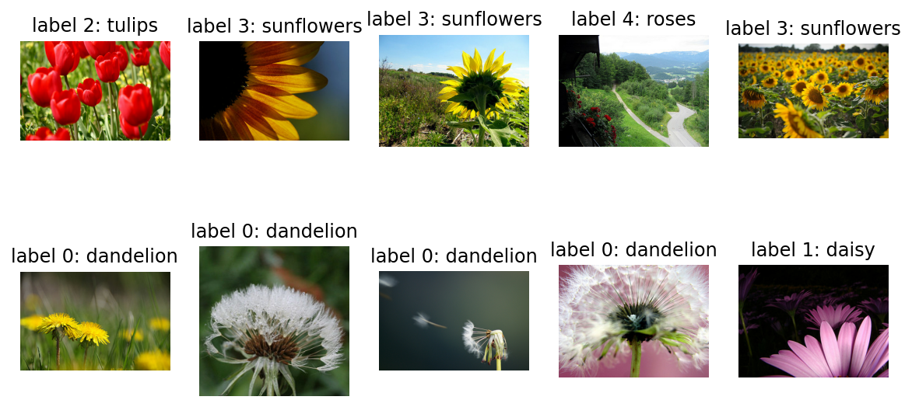
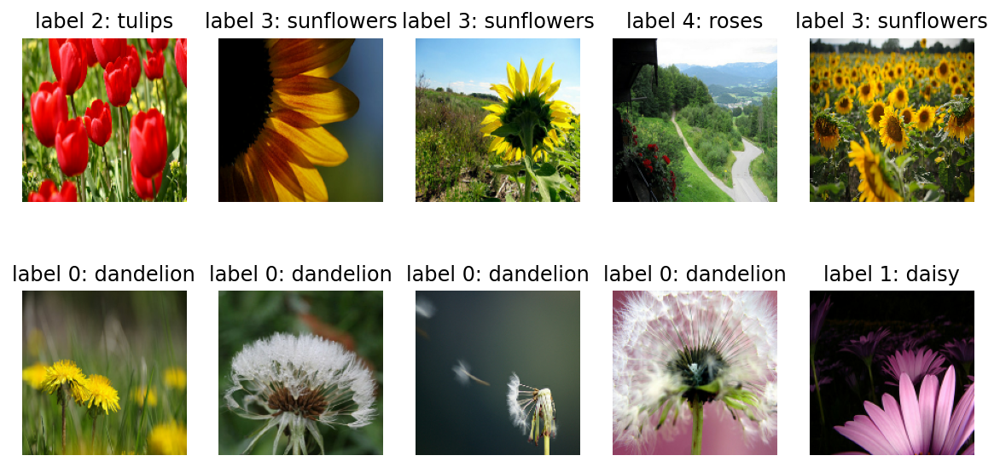
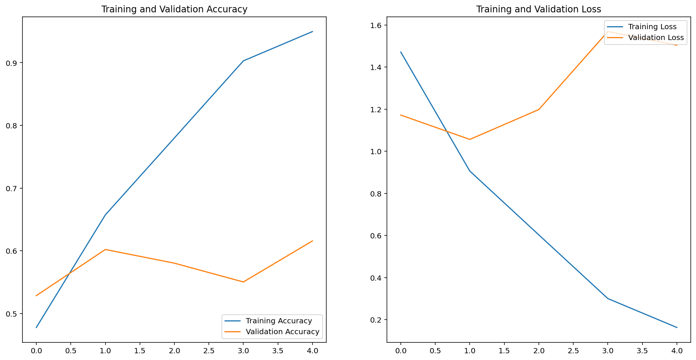
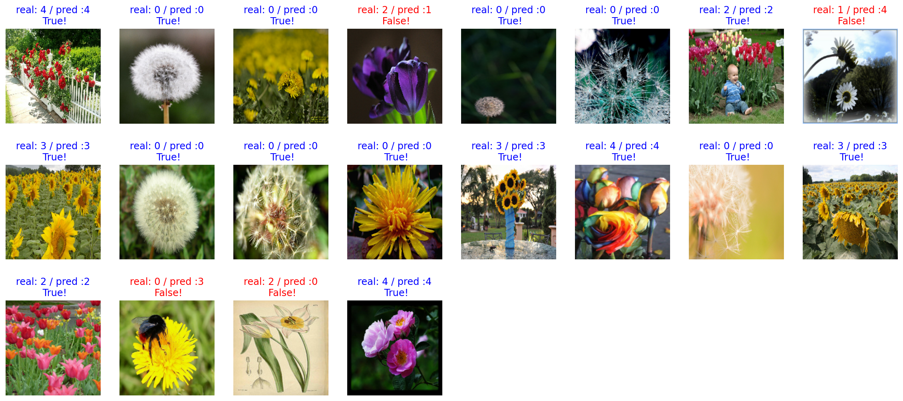
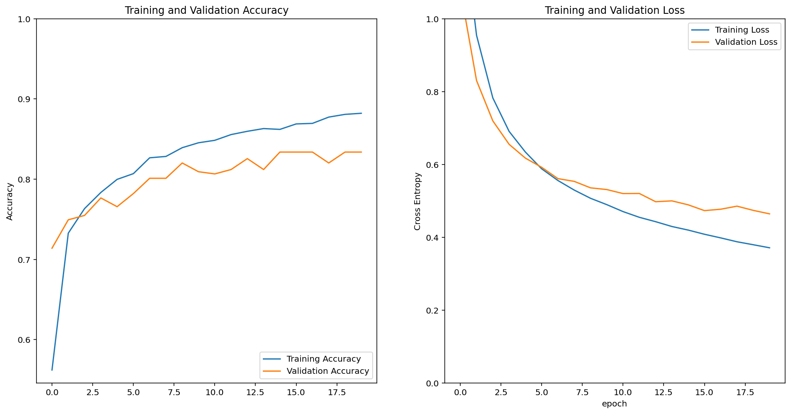

Step 1. 데이터셋 내려받기
이번에는 tensorflow_datasets 에 포함된 tf_flowers 데이터를 사용해 보겠습니다. tf_flowers 데이터에 대한 정보는 다음에서 확인해볼 수 있습니다.
tfds.load를 활용하여 데이터셋을 다운받으세요.
https://www.tensorflow.org/datasets/catalog/tf_flowers

Step 2. 데이터셋을 모델에 넣을 수 있는 형태로 준비하기
이미지를 모두 같은 크기로 formatting 한 후, train_batches, validation_batches, test_batches를 준비합니다.

Step 3. 모델 설계하기
모델은 어떤 방식으로 설계하고 싶은가요? 나만의 모델을 만들 것인가요, 아니면 base_model을 활용할 것인가요?
원하는 방식으로 모델을 만들어 보세요!
cats_vs_dogs 의 경우와 달리, tf_flowers 데이터셋에서는 class의 갯수가 5가지입니다. 모델 설계시 어느 부분이 달라질지에 유의해 주세요.

Step 4. 모델 학습시키기
모델을 학습시켜봅니다. 단, 여기에서는 여러 가지 옵션을 바꿔볼 수 있습니다.
예를 들어, 모델 학습을 10 epoch보다 더 많이 시켜보거나, learning_rate 값을 바꿔볼 수 있습니다.
또는, optimizer의 종류도 바꿔볼 수 있습니다. 바꿔보고 싶다면, 여기를 참고하세요.
어쩌면 VGG16이 아닌 다른 모델을 base model로 활용할 수도 있을 것입니다. 그리고 파인튜닝을 fc layer의 구성에 변화를 줄 수 있을지도 모릅니다.
이전 스텝에서는 시도하지 않았던 Regularization 기법이 적용된다면 어떨까요? Dropout이나 Batch Normalization을 적용하는 것은 그리 어려운 일이 아닙니다.

Step 5. 모델 성능 평가하기
모델 학습이 완료되었다면, 모델의 성능을 평가할 차례입니다.
모델이 학습된 과정을 그래프로도 그려보고, validation_batches나 test_batches에 있는 데이터에 대한 예측 결과도 확인해 보세요!

Step 6. 모델 활용하기
모델이 꽤나 똑똑해졌다면, 이제 활용해볼 수 있습니다.
원하는 이미지를 자유롭게 모델에 입력해 보고, 어떤 예측 결과를 내는지 확인해 보세요!


```python
import tensorflow_datasets as tfds
import tensorflow as tf
import matplotlib.pyplot as plt
%matplotlib inline
%config InlineBackend.figure_format = 'retina'
import warnings
warnings.filterwarnings("ignore")
```


```python
#데이터셋 다운로드 및 데이터 준비

(raw_train, raw_validation, raw_test), metadata = tfds.load(
    'tf_flowers',
    split=['train[:80%]', 'train[80%:90%]', 'train[90%:]'],
    with_info=True,
    as_supervised=True,
)
```


```python
#불러온 데이터 확인

plt.figure(figsize=(10, 5))


get_label_name = metadata.features['label'].int2str

for idx, (image, label) in enumerate(raw_train.take(10)):
    plt.subplot(2, 5, idx+1)
    plt.imshow(image)
    plt.title(f'label {label}: {get_label_name(label)}')
    plt.axis('off')
```





```python
#데이터 리사이징

IMG_SIZE = 160

def format_example(image, label):
    image = tf.cast(image, tf.float32)
    image = (image/127.5) - 1
    image = tf.image.resize(image, (IMG_SIZE, IMG_SIZE))
    return image, label
```


```python
#데이터 리사이징 확인

train = raw_train.map(format_example)
validation = raw_validation.map(format_example)
test = raw_test.map(format_example)

plt.figure(figsize=(10, 5))


get_label_name = metadata.features['label'].int2str

for idx, (image, label) in enumerate(train.take(10)):
    plt.subplot(2, 5, idx+1)
    image = (image + 1) / 2
    plt.imshow(image)
    plt.title(f'label {label}: {get_label_name(label)}')
    plt.axis('off')
```





```python
#데이터에 맵핑

train = raw_train.map(format_example)
validation = raw_validation.map(format_example)
test = raw_test.map(format_example)
```


```python
from tensorflow.keras.models import Sequential
from tensorflow.keras.layers import Dense, Conv2D, Flatten, MaxPooling2D
```


```python
#학습 모델 제작

from tensorflow.keras.models import Sequential
from tensorflow.keras.layers import Dense, Conv2D, Flatten, MaxPooling2D

model = Sequential([
    Conv2D(filters=16, kernel_size=3, padding='same', activation='relu', input_shape=(160, 160, 3)),
    MaxPooling2D(),
    Conv2D(filters=32, kernel_size=3, padding='same', activation='relu'),
    MaxPooling2D(),
    Conv2D(filters=64, kernel_size=3, padding='same', activation='relu'),
    MaxPooling2D(),
    Flatten(),
    Dense(units=512, activation='relu'),
    Dense(units=5, activation='softmax')
])

model.summary()
```

    Model: "sequential"
    _________________________________________________________________
    Layer (type)                 Output Shape              Param #   
    =================================================================
    conv2d (Conv2D)              (None, 160, 160, 16)      448       
    _________________________________________________________________
    max_pooling2d (MaxPooling2D) (None, 80, 80, 16)        0         
    _________________________________________________________________
    conv2d_1 (Conv2D)            (None, 80, 80, 32)        4640      
    _________________________________________________________________
    max_pooling2d_1 (MaxPooling2 (None, 40, 40, 32)        0         
    _________________________________________________________________
    conv2d_2 (Conv2D)            (None, 40, 40, 64)        18496     
    _________________________________________________________________
    max_pooling2d_2 (MaxPooling2 (None, 20, 20, 64)        0         
    _________________________________________________________________
    flatten (Flatten)            (None, 25600)             0         
    _________________________________________________________________
    dense (Dense)                (None, 512)               13107712  
    _________________________________________________________________
    dense_1 (Dense)              (None, 5)                 2565      
    =================================================================
    Total params: 13,133,861
    Trainable params: 13,133,861
    Non-trainable params: 0
    _________________________________________________________________


```python
#하이퍼 파라미터 조정

base_learning_rate = 0.001
model.compile(optimizer=tf.keras.optimizers.RMSprop(lr=base_learning_rate),
              loss=tf.keras.losses.sparse_categorical_crossentropy,
              metrics=['accuracy'])

BATCH_SIZE = 20
SHUFFLE_BUFFER_SIZE = 1000

train_batches = train.shuffle(SHUFFLE_BUFFER_SIZE).batch(BATCH_SIZE)
validation_batches = validation.batch(BATCH_SIZE)
test_batches = test.batch(BATCH_SIZE)
```


```python
#초기 예측값 확인

validation_steps = 15
loss0, accuracy0 = model.evaluate(validation_batches, steps=validation_steps)

print("initial loss: {:.2f}".format(loss0))
print("initial accuracy: {:.2f}".format(accuracy0))
```

    15/15 [==============================] - 0s 9ms/step - loss: 1.6574 - accuracy: 0.1667
    initial loss: 1.66
    initial accuracy: 0.17


```python
#학습 시작

EPOCHS = 5
history = model.fit(train_batches,
                    epochs=EPOCHS,
                    validation_data=validation_batches)
```

    Epoch 1/5
    147/147 [==============================] - 16s 107ms/step - loss: 1.4718 - accuracy: 0.4779 - val_loss: 1.1722 - val_accuracy: 0.5286
    Epoch 2/5
    147/147 [==============================] - 3s 18ms/step - loss: 0.9061 - accuracy: 0.6574 - val_loss: 1.0564 - val_accuracy: 0.6022
    Epoch 3/5
    147/147 [==============================] - 3s 19ms/step - loss: 0.6027 - accuracy: 0.7800 - val_loss: 1.1984 - val_accuracy: 0.5804
    Epoch 4/5
    147/147 [==============================] - 3s 19ms/step - loss: 0.3000 - accuracy: 0.9029 - val_loss: 1.5690 - val_accuracy: 0.5504
    Epoch 5/5
    147/147 [==============================] - 3s 18ms/step - loss: 0.1626 - accuracy: 0.9496 - val_loss: 1.5044 - val_accuracy: 0.6158


```python
#학습 과정 확인

acc = history.history['accuracy']
val_acc = history.history['val_accuracy']

loss=history.history['loss']
val_loss=history.history['val_loss']

epochs_range = range(EPOCHS)

plt.figure(figsize=(16, 8))
plt.subplot(1, 2, 1)
plt.plot(epochs_range, acc, label='Training Accuracy')
plt.plot(epochs_range, val_acc, label='Validation Accuracy')
plt.legend(loc='lower right')
plt.title('Training and Validation Accuracy')

plt.subplot(1, 2, 2)
plt.plot(epochs_range, loss, label='Training Loss')
plt.plot(epochs_range, val_loss, label='Validation Loss')
plt.legend(loc='upper right')
plt.title('Training and Validation Loss')
plt.show()
```





하이퍼 파라미터 조정 : valdiation loss의 감소가 멈춘 시점인 echo 횟수 5회까지만 진행. 기존 모델의 최종 값 66%


```python
for image_batch, label_batch in test_batches.take(1):
    images = image_batch
    labels = label_batch
    predictions = model.predict(image_batch)
    pass

predictions
```


    array([[5.29555073e-05, 1.20948635e-05, 7.08534522e-03, 3.13971043e-02,
            9.61452544e-01],
           [9.99655128e-01, 3.40732629e-04, 5.66089511e-07, 5.98369212e-08,
            3.55162638e-06],
           [7.21081138e-01, 2.70276004e-03, 8.40896461e-03, 2.63976932e-01,
            3.83016234e-03],
           [1.77408487e-01, 3.80110472e-01, 1.55216366e-01, 5.60402870e-03,
            2.81660616e-01],
           [7.41918683e-01, 5.26533648e-02, 2.86507420e-02, 3.06766275e-02,
            1.46100566e-01],
           [6.28545582e-01, 7.88442558e-04, 5.56072337e-05, 3.65448505e-01,
            5.16181532e-03],
           [3.70531902e-03, 1.05995312e-01, 6.69127107e-01, 7.10848812e-03,
            2.14063704e-01],
           [3.38331640e-01, 1.40871778e-01, 1.80903841e-02, 4.34416346e-03,
            4.98362094e-01],
           [2.93520134e-04, 3.01162203e-07, 7.58797614e-06, 9.99691606e-01,
            6.95969266e-06],
           [9.99955893e-01, 1.99120841e-05, 3.14070519e-07, 1.62869583e-07,
            2.37152017e-05],
           [9.99988794e-01, 3.37983784e-06, 2.96147551e-08, 9.26641519e-08,
            7.70927545e-06],
           [6.44596279e-01, 6.76413241e-04, 1.60731692e-02, 2.34986112e-01,
            1.03668064e-01],
           [5.65889468e-06, 2.05124522e-07, 1.73692428e-07, 9.99993443e-01,
            5.64956906e-07],
           [1.93119957e-03, 2.45903395e-02, 3.43978368e-02, 1.78600680e-02,
            9.21220601e-01],
           [7.13259041e-01, 5.20864083e-03, 9.21661407e-03, 1.43654819e-03,
            2.70879179e-01],
           [7.83025753e-05, 4.19439317e-07, 1.14932964e-05, 9.99905825e-01,
            4.07035213e-06],
           [8.70632430e-05, 1.86427636e-03, 6.76103830e-01, 1.02263084e-02,
            3.11718524e-01],
           [4.88168485e-02, 6.83850376e-04, 1.98333131e-04, 9.50267076e-01,
            3.39003273e-05],
           [9.93353009e-01, 1.16978947e-03, 1.45364083e-05, 9.08241345e-05,
            5.37168980e-03],
           [1.99412857e-03, 8.34884774e-03, 2.32336437e-03, 1.63579045e-06,
            9.87332046e-01]], dtype=float32)


```python
import numpy as np
predictions = np.argmax(predictions, axis=1)
predictions
```


    array([4, 0, 0, 1, 0, 0, 2, 4, 3, 0, 0, 0, 3, 4, 0, 3, 2, 3, 0, 4])


```python
#테스트 샘플 추출

plt.figure(figsize=(20, 12))

for idx, (image, label, prediction) in enumerate(zip(images, labels, predictions)):
    plt.subplot(4, 8, idx+1)
    image = (image + 1) / 2
    plt.imshow(image)
    correct = label == prediction
    title = f'real: {label} / pred :{prediction}\n {correct}!'
    if not correct:
        plt.title(title, fontdict={'color': 'red'})
    else:
        plt.title(title, fontdict={'color': 'blue'})
    plt.axis('off')
```





```python
#테스트 샘플의 정확도

count = 0
for image, label, prediction in zip(images, labels, predictions):
    correct = label == prediction
    if correct:
        count = count + 1

print(count / 20 * 100)
```

    80.0


```python
#참고할 모델 설정

IMG_SHAPE = (IMG_SIZE, IMG_SIZE, 3)

# Create the base model from the pre-trained model VGG16
base_model = tf.keras.applications.VGG16(input_shape=IMG_SHAPE,
                                         include_top=False,
                                         weights='imagenet')

feature_batch = base_model(image_batch)
feature_batch.shape

base_model.summary()
```

    Model: "vgg16"
    _________________________________________________________________
    Layer (type)                 Output Shape              Param #   
    =================================================================
    input_1 (InputLayer)         [(None, 160, 160, 3)]     0         
    _________________________________________________________________
    block1_conv1 (Conv2D)        (None, 160, 160, 64)      1792      
    _________________________________________________________________
    block1_conv2 (Conv2D)        (None, 160, 160, 64)      36928     
    _________________________________________________________________
    block1_pool (MaxPooling2D)   (None, 80, 80, 64)        0         
    _________________________________________________________________
    block2_conv1 (Conv2D)        (None, 80, 80, 128)       73856     
    _________________________________________________________________
    block2_conv2 (Conv2D)        (None, 80, 80, 128)       147584    
    _________________________________________________________________
    block2_pool (MaxPooling2D)   (None, 40, 40, 128)       0         
    _________________________________________________________________
    block3_conv1 (Conv2D)        (None, 40, 40, 256)       295168    
    _________________________________________________________________
    block3_conv2 (Conv2D)        (None, 40, 40, 256)       590080    
    _________________________________________________________________
    block3_conv3 (Conv2D)        (None, 40, 40, 256)       590080    
    _________________________________________________________________
    block3_pool (MaxPooling2D)   (None, 20, 20, 256)       0         
    _________________________________________________________________
    block4_conv1 (Conv2D)        (None, 20, 20, 512)       1180160   
    _________________________________________________________________
    block4_conv2 (Conv2D)        (None, 20, 20, 512)       2359808   
    _________________________________________________________________
    block4_conv3 (Conv2D)        (None, 20, 20, 512)       2359808   
    _________________________________________________________________
    block4_pool (MaxPooling2D)   (None, 10, 10, 512)       0         
    _________________________________________________________________
    block5_conv1 (Conv2D)        (None, 10, 10, 512)       2359808   
    _________________________________________________________________
    block5_conv2 (Conv2D)        (None, 10, 10, 512)       2359808   
    _________________________________________________________________
    block5_conv3 (Conv2D)        (None, 10, 10, 512)       2359808   
    _________________________________________________________________
    block5_pool (MaxPooling2D)   (None, 5, 5, 512)         0         
    =================================================================
    Total params: 14,714,688
    Trainable params: 14,714,688
    Non-trainable params: 0
    _________________________________________________________________


```python
#dense 레이어 변경

global_average_layer = tf.keras.layers.GlobalAveragePooling2D()

feature_batch_average = global_average_layer(feature_batch)
print(feature_batch_average.shape)

dense_layer = tf.keras.layers.Dense(512, activation='relu')
prediction_layer = tf.keras.layers.Dense(5, activation='softmax')

# feature_batch_averag가 dense_layer를 거친 결과가 다시 prediction_layer를 거치게 되면
prediction_batch = prediction_layer(dense_layer(feature_batch_average))  
print(prediction_batch.shape)

base_model.trainable = False #모델 학습은 하지 않는다.
```

    (20, 512)
    (20, 5)


```python
#개선된 모델 설계

model = tf.keras.Sequential([
  base_model,
  global_average_layer,
  dense_layer,
  prediction_layer
])

model.summary()
```

    Model: "sequential_1"
    _________________________________________________________________
    Layer (type)                 Output Shape              Param #   
    =================================================================
    vgg16 (Model)                (None, 5, 5, 512)         14714688  
    _________________________________________________________________
    global_average_pooling2d (Gl (None, 512)               0         
    _________________________________________________________________
    dense_2 (Dense)              (None, 512)               262656    
    _________________________________________________________________
    dense_3 (Dense)              (None, 5)                 2565      
    =================================================================
    Total params: 14,979,909
    Trainable params: 265,221
    Non-trainable params: 14,714,688
    _________________________________________________________________


```python
base_learning_rate = 0.0001
model.compile(optimizer=tf.keras.optimizers.Adam(lr=base_learning_rate),
              loss=tf.keras.losses.sparse_categorical_crossentropy,
              metrics=['accuracy'])

validation_steps=15
loss0, accuracy0 = model.evaluate(validation_batches, steps = validation_steps)

print("initial loss: {:.2f}".format(loss0))
print("initial accuracy: {:.2f}".format(accuracy0))
```

    15/15 [==============================] - 1s 44ms/step - loss: 1.6830 - accuracy: 0.1700
    initial loss: 1.68
    initial accuracy: 0.17


```python
EPOCHS = 20

history = model.fit(train_batches,
                    epochs=EPOCHS,
                    validation_data=validation_batches)
```

    Epoch 1/20
    147/147 [==============================] - 41s 279ms/step - loss: 1.3231 - accuracy: 0.5620 - val_loss: 1.0813 - val_accuracy: 0.7139
    Epoch 2/20
    147/147 [==============================] - 9s 60ms/step - loss: 0.9546 - accuracy: 0.7326 - val_loss: 0.8304 - val_accuracy: 0.7493
    Epoch 3/20
    147/147 [==============================] - 9s 63ms/step - loss: 0.7826 - accuracy: 0.7633 - val_loss: 0.7195 - val_accuracy: 0.7548
    Epoch 4/20
    147/147 [==============================] - 9s 59ms/step - loss: 0.6907 - accuracy: 0.7834 - val_loss: 0.6552 - val_accuracy: 0.7766
    Epoch 5/20
    147/147 [==============================] - 9s 59ms/step - loss: 0.6339 - accuracy: 0.7997 - val_loss: 0.6173 - val_accuracy: 0.7657
    Epoch 6/20
    147/147 [==============================] - 9s 58ms/step - loss: 0.5879 - accuracy: 0.8069 - val_loss: 0.5920 - val_accuracy: 0.7820
    Epoch 7/20
    147/147 [==============================] - 9s 58ms/step - loss: 0.5557 - accuracy: 0.8266 - val_loss: 0.5609 - val_accuracy: 0.8011
    Epoch 8/20
    147/147 [==============================] - 9s 59ms/step - loss: 0.5295 - accuracy: 0.8283 - val_loss: 0.5534 - val_accuracy: 0.8011
    Epoch 9/20
    147/147 [==============================] - 9s 60ms/step - loss: 0.5070 - accuracy: 0.8392 - val_loss: 0.5356 - val_accuracy: 0.8202
    Epoch 10/20
    147/147 [==============================] - 9s 63ms/step - loss: 0.4895 - accuracy: 0.8454 - val_loss: 0.5309 - val_accuracy: 0.8093
    Epoch 11/20
    147/147 [==============================] - 9s 58ms/step - loss: 0.4704 - accuracy: 0.8484 - val_loss: 0.5199 - val_accuracy: 0.8065
    Epoch 12/20
    147/147 [==============================] - 9s 62ms/step - loss: 0.4547 - accuracy: 0.8556 - val_loss: 0.5201 - val_accuracy: 0.8120
    Epoch 13/20
    147/147 [==============================] - 10s 66ms/step - loss: 0.4427 - accuracy: 0.8597 - val_loss: 0.4975 - val_accuracy: 0.8256
    Epoch 14/20
    147/147 [==============================] - 9s 64ms/step - loss: 0.4295 - accuracy: 0.8631 - val_loss: 0.4999 - val_accuracy: 0.8120
    Epoch 15/20
    147/147 [==============================] - 9s 62ms/step - loss: 0.4196 - accuracy: 0.8621 - val_loss: 0.4890 - val_accuracy: 0.8338
    Epoch 16/20
    147/147 [==============================] - 10s 65ms/step - loss: 0.4082 - accuracy: 0.8689 - val_loss: 0.4731 - val_accuracy: 0.8338
    Epoch 17/20
    147/147 [==============================] - 9s 63ms/step - loss: 0.3981 - accuracy: 0.8696 - val_loss: 0.4769 - val_accuracy: 0.8338
    Epoch 18/20
    147/147 [==============================] - 9s 61ms/step - loss: 0.3875 - accuracy: 0.8774 - val_loss: 0.4853 - val_accuracy: 0.8202
    Epoch 19/20
    147/147 [==============================] - 9s 58ms/step - loss: 0.3794 - accuracy: 0.8808 - val_loss: 0.4737 - val_accuracy: 0.8338
    Epoch 20/20
    147/147 [==============================] - 9s 58ms/step - loss: 0.3710 - accuracy: 0.8822 - val_loss: 0.4642 - val_accuracy: 0.8338


```python
#학습 과정 확인

acc = history.history['accuracy']
val_acc = history.history['val_accuracy']

loss = history.history['loss']
val_loss = history.history['val_loss']

plt.figure(figsize=(16, 8))
plt.subplot(1, 2, 1)
plt.plot(acc, label='Training Accuracy')
plt.plot(val_acc, label='Validation Accuracy')
plt.legend(loc='lower right')
plt.ylabel('Accuracy')
plt.ylim([min(plt.ylim()),1])
plt.title('Training and Validation Accuracy')

plt.subplot(1, 2, 2)
plt.plot(loss, label='Training Loss')
plt.plot(val_loss, label='Validation Loss')
plt.legend(loc='upper right')
plt.ylabel('Cross Entropy')
plt.ylim([0,1.0])
plt.title('Training and Validation Loss')
plt.xlabel('epoch')
plt.show()
```





```python
#예측 확인

for image_batch, label_batch in test_batches.take(1):
    images = image_batch
    labels = label_batch
    predictions = model.predict(image_batch)
    pass

predictions
```


    array([[6.8012914e-03, 2.6638685e-02, 8.7114954e-01, 1.5436996e-02,
            7.9973541e-02],
           [9.9959451e-01, 3.6815021e-04, 9.7693328e-07, 1.1946242e-05,
            2.4463521e-05],
           [6.4702338e-01, 1.6571635e-01, 2.0388182e-02, 1.4943276e-01,
            1.7439311e-02],
           [4.8728232e-04, 4.1816547e-03, 6.2656075e-01, 2.6158621e-03,
            3.6615449e-01],
           [6.0644919e-01, 3.5538390e-01, 1.1735550e-02, 1.2390365e-02,
            1.4040938e-02],
           [9.2316377e-01, 4.8514768e-02, 3.3157577e-03, 2.4193734e-02,
            8.1209547e-04],
           [2.5640696e-03, 3.8233891e-03, 9.1883582e-01, 4.8844054e-02,
            2.5932714e-02],
           [3.5291231e-01, 5.8693314e-01, 4.7935819e-04, 5.8232054e-02,
            1.4431491e-03],
           [2.3343775e-03, 3.3885849e-04, 1.2482814e-02, 9.4975346e-01,
            3.5090532e-02],
           [9.9947995e-01, 4.7428586e-04, 5.6386546e-07, 4.4010569e-05,
            1.2417190e-06],
           [9.7004592e-01, 2.5247136e-02, 3.1400096e-04, 3.9880658e-03,
            4.0479875e-04],
           [2.8604865e-01, 5.2618969e-02, 1.8721563e-01, 4.6898058e-01,
            5.1362049e-03],
           [5.6166374e-03, 5.4965913e-03, 8.4416725e-02, 8.3878785e-01,
            6.5682195e-02],
           [1.2141003e-03, 3.5888210e-02, 4.2311251e-01, 5.8426760e-02,
            4.8135841e-01],
           [8.8025582e-01, 7.9731703e-02, 1.0843063e-02, 9.1208918e-03,
            2.0048577e-02],
           [1.2279196e-04, 3.0289742e-04, 8.6767664e-03, 9.8995638e-01,
            9.4128738e-04],
           [3.3874973e-04, 1.5816491e-03, 9.3879527e-01, 7.7576530e-03,
            5.1526625e-02],
           [9.4216388e-01, 5.3397670e-02, 3.2507748e-04, 4.0232143e-03,
            9.0141162e-05],
           [1.3750955e-03, 8.2319409e-02, 7.4511707e-01, 1.0095047e-01,
            7.0237882e-02],
           [3.8597375e-02, 1.7547645e-02, 3.7491086e-01, 1.9312905e-02,
            5.4963124e-01]], dtype=float32)


```python
predictions = np.argmax(predictions, axis=1)
predictions
```


    array([2, 0, 0, 2, 0, 0, 2, 1, 3, 0, 0, 3, 3, 4, 0, 3, 2, 0, 2, 4])


```python
#샘플을 추출해서 확인

plt.figure(figsize=(20, 12))

for idx, (image, label, prediction) in enumerate(zip(images, labels, predictions)):
    plt.subplot(4, 8, idx+1)
    image = (image + 1) / 2
    plt.imshow(image)
    correct = label == prediction
    title = f'real: {label} / pred :{prediction}\n {correct}!'
    if not correct:
        plt.title(title, fontdict={'color': 'red'})
    else:
        plt.title(title, fontdict={'color': 'blue'})
    plt.axis('off')
```


```python
#추출된 샘플의 정확도

count = 0
for image, label, prediction in zip(images, labels, predictions):
    correct = label == prediction
    if correct:
        count = count + 1

print(count / 20 * 100)
```

    90.0


첫번째 학습 모델에서 10회 반복한 결과 특정 시점 이후 정확도는 횡보하였고 벨리데이션 로스는 증가하는 결과를 보였다. 때문에 벨리데이션 로스와 정확도가 교차하는 5회로 설정하였으나 정확도는 60%대를 벗어나지 못하여 VGG16 학습 모델을 선택하였고 약 83%의 정확도를 얻어낼 수 있었다. 이후 옵티마이저의 모델을 기존 RMSProp에서 Adam으로 변경하여 80% 후반까지 정확도를 끌어올릴 수 있었다. 학습모델 선택시 가장 중요한 요소는 해당 모델이 어떤 카테고리의 데이터를 다루고 있느냐가 첫번째이고 그 이후 각 모델이 요구하는 데이터의 종류, 모델의 특징과 필요한 결과값을 비교하여 선택하여야 한다.
